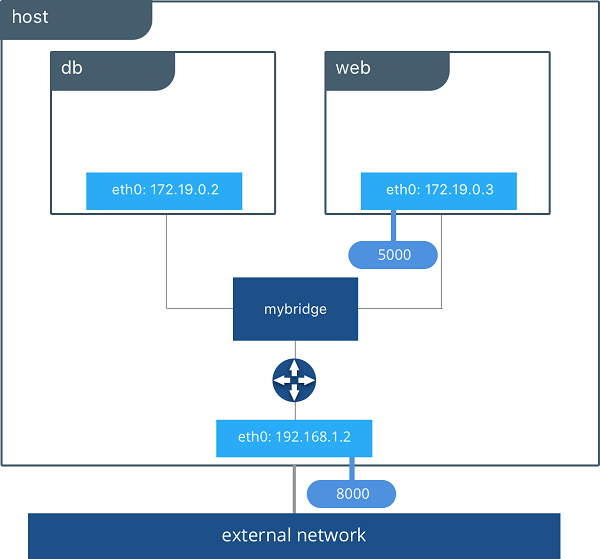

# 01 - O que são Networks

Por padrão, os containers Docker são isolados uns dos outros e não podem se comunicar. Para que os containers possam se comunicar, é necessário criar uma rede.

As networks são uma coleção de sub-redes que permitem que os containers se comuniquem entre si e com o host. As networks podem ser criadas usando o Docker CLI ou o Docker Compose.

Os containers herdam configurações de rede do host, como DNS e outros configurações que estão no `/etc/resolv.conf`.

## Tipos de networks

O Docker possui 5 tipos de networks:

- **bridge**: É o tipo de network padrão. Cria um link entre os containers permitindo a comunicação encaminhando o tráfego entre os segmentos de rede. Os containers ficam isolados de outros containers e podem se comunicar com o host através do gateway da rede. Todos os containers recebem um IP interno da rede. Eles também podem se comunicar internamente através dos seus IPs.

- **host**: Em vez de receber um IP interno e criar um isolamento, os containers compartilham a rede o host. Esta opção é muito performática, já que não há isolamento de rede, re-encaminhamento de portas ou pontes de redes, o acesso é direto.

- **overlay**: Criar uma rede distribuída entre múltiplos Docker Daemon, esta rede fica sobreposta as redes específicas do host. É muito útil para trabalhar com Docker Swarm, já que os containers podem se comunicar entre os nós do cluster.

- **ipvlan**, **macvlan** e **none**: São redes avançadas que não serão abordadas neste curso. Ver documentação oficial [https://docs.docker.com/network/drivers/](https://docs.docker.com/network/drivers/) para mais informações.

